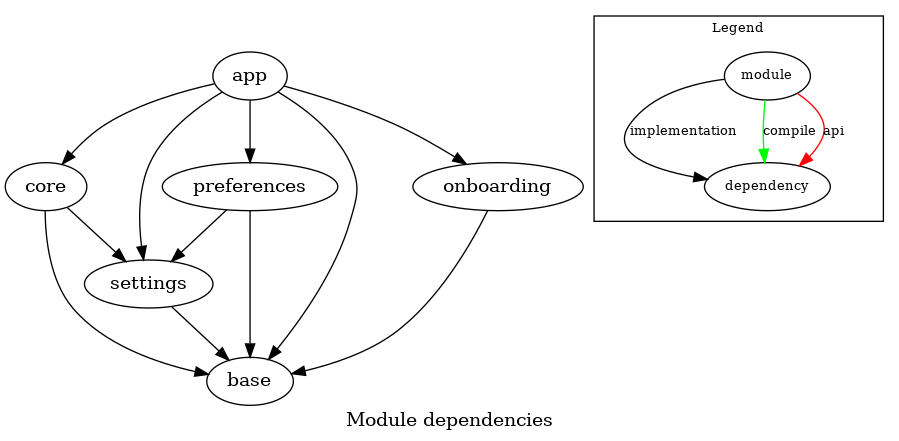

# Adblock Plus for Samsung Internet Architecture

## MVVM
ABP-SI is a multi-module MVVM Android App.

MVVM architecture is a Model-View-ViewModel architecture that removes the tight coupling between each component. Most importantly, in this architecture, the children don't have the direct reference to the parent, they only have the reference by observables.

-   **Model:**  Represents the data and the business logic of the Android Application. It consists of the business logic - local and remote data source, model classes, repository.
-   **View:**  Consists of the UI Code(Activity, Fragment), XML. It sends the user action to the ViewModel but does  **not**  get the response back directly. To get the response, it has to subscribe to the observables (`LiveData`) which ViewModel exposes to it.
-   **ViewModel:**  Is a bridge between the View and Model. It does not have any clue which View has to use it as it should not have any direct reference to the View. Basically, the ViewModel should not be aware of the view who is interacting with. It interacts with the Model and exposes the observable that can be observed by the View.
[More information on MVVM and architecture components on Android](https://developer.android.com/jetpack/guide)

## Modules
The app is comprised of the following modules:
 - **app**
 - **base**
 - **onboarding**
 - **preferences**
 - **settings**
 - **core**

### app
The **app** module contains the `Application`class, the launcher `Activity` and the main `Activity` with the application _navigation graph_.

### base
The **base** module contains utility and helper classes/functions, base _models_ and _interfaces_ that are available to all other modules. This is a self contained module that shouldn't depend on any other.

### onboarding
Self contained onboarding module contains all the Onboarding UI code.

### preferences
The preferences module contains all the UI code for user preferences. It communicates with the _settings_ module, where the **Model** lives, and with the core via the `SubscriptionsManager` interface (from **base** module).

### settings
Settings module contains the **Model** for the user preferences, containing the _repository_ and _data sources_ for user preferences and configurations.

### core
The core module is responsible for listening to _settings_ changes and download/update the filters list accordingly. It is also responsible to schedule and manage automatic updates and provide a unified filters list file to the Samsung Internet browser. This update mechanism is described in details [here](https://gitlab.com/eyeo/distpartners/adblockplussbrowser/-/blob/dev/subscriptions-updates.md).